# [📈 Live Status](https://demo.upptime.js.org): <!--live status--> **🟧 Partial outage**

This repository contains the open-source uptime monitor and status page for [Upptime](https://upptime.js.org), powered by [Upptime](https://github.com/upptime/upptime).

With [Upptime](https://upptime.js.org), you can get your own unlimited and free uptime monitor and status page, powered entirely by a GitHub repository. We use [Issues](https://github.com/upptime/upptime/issues) as incident reports, [Actions](https://github.com/Sahalandro/upptimecheck/actions) as uptime monitors, and [Pages](https://demo.upptime.js.org) for the status page.

<!--start: status pages-->
<!-- This summary is generated by Upptime (https://github.com/upptime/upptime) -->
<!-- Do not edit this manually, your changes will be overwritten -->
<!-- prettier-ignore -->
| URL | Status | History | Response Time | Uptime |
| --- | ------ | ------- | ------------- | ------ |
|  [britta-ai](www.britta-ai.de) | 🟩 Up | [britta-ai.yml](https://github.com/Sahalandro/upptimecheck/commits/HEAD/history/britta-ai.yml) | 

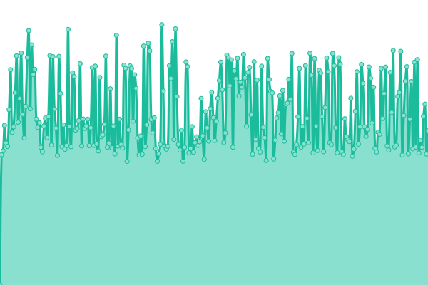 2115ms
     
 | 

<a href="https://Sahalandro.github.io/upptimecheck/history/britta-ai">97.11%</a>
    

|  [gymdistrict](https://gymdistrict.de/) | 🟩 Up | [gymdistrict.yml](https://github.com/Sahalandro/upptimecheck/commits/HEAD/history/gymdistrict.yml) | 

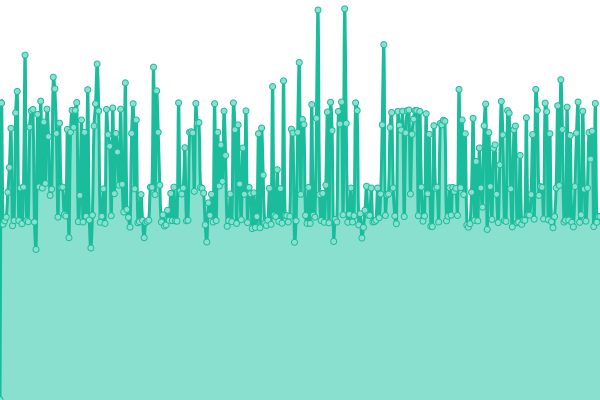 784ms
     
 | 

<a href="https://Sahalandro.github.io/upptimecheck/history/gymdistrict">97.12%</a>
    

|  [sportbutler](https://sportbutler.team/) | 🟩 Up | [sportbutler.yml](https://github.com/Sahalandro/upptimecheck/commits/HEAD/history/sportbutler.yml) | 

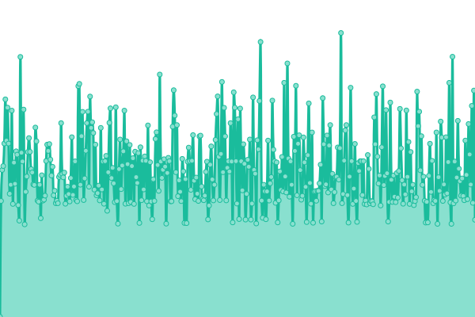 842ms
     
 | 

<a href="https://Sahalandro.github.io/upptimecheck/history/sportbutler">97.12%</a>
    

|  [hüpfburgen-verleih](https://holsteiner-huepfburgenverleih.de/) | 🟩 Up | [huepfburgen-verleih.yml](https://github.com/Sahalandro/upptimecheck/commits/HEAD/history/huepfburgen-verleih.yml) | 

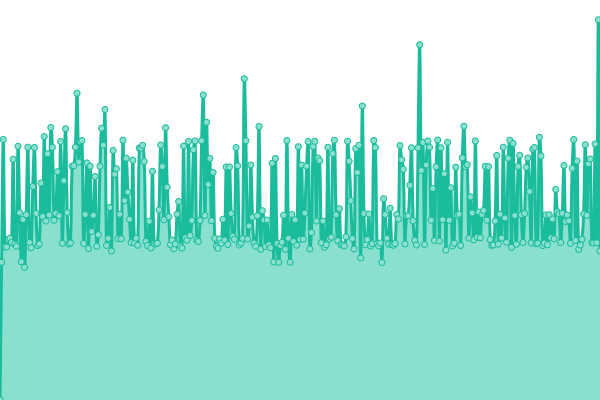 775ms
     
 | 

<a href="https://Sahalandro.github.io/upptimecheck/history/huepfburgen-verleih">97.13%</a>
    

|  [ki-helfer-klinik](ki-helfer-klinik.mbd-team.de) | 🟩 Up | [ki-helfer-klinik.yml](https://github.com/Sahalandro/upptimecheck/commits/HEAD/history/ki-helfer-klinik.yml) | 

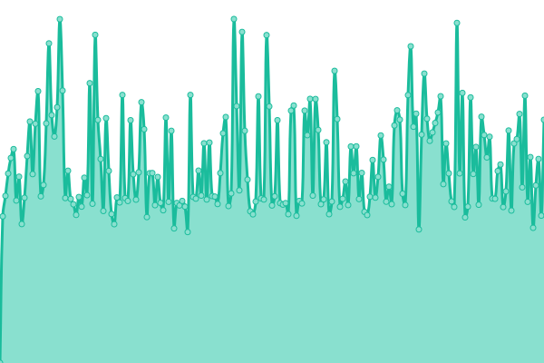 1362ms
     
 | 

<a href="https://Sahalandro.github.io/upptimecheck/history/ki-helfer-klinik">94.26%</a>
    

|  [app.ki-helferlein](app.ki-helferlein.de) | 🟩 Up | [app-ki-helferlein.yml](https://github.com/Sahalandro/upptimecheck/commits/HEAD/history/app-ki-helferlein.yml) | 

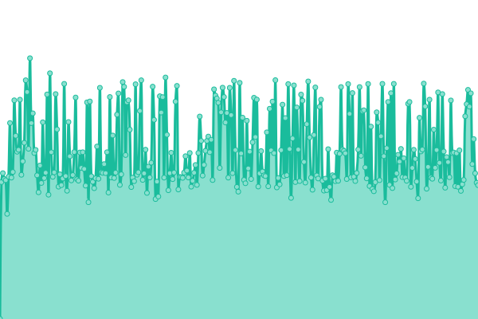 1341ms
     
 | 

<a href="https://Sahalandro.github.io/upptimecheck/history/app-ki-helferlein">97.14%</a>
    

|  [ki-helferlein](ki-helferlein.de) | 🟩 Up | [ki-helferlein.yml](https://github.com/Sahalandro/upptimecheck/commits/HEAD/history/ki-helferlein.yml) | 

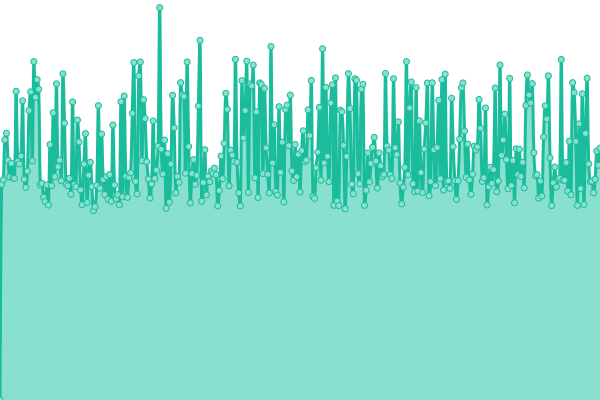 1869ms
     
 | 

<a href="https://Sahalandro.github.io/upptimecheck/history/ki-helferlein">97.14%</a>
    

|  [mbd-team](https://mbd-team.de/) | 🟩 Up | [mbd-team.yml](https://github.com/Sahalandro/upptimecheck/commits/HEAD/history/mbd-team.yml) | 

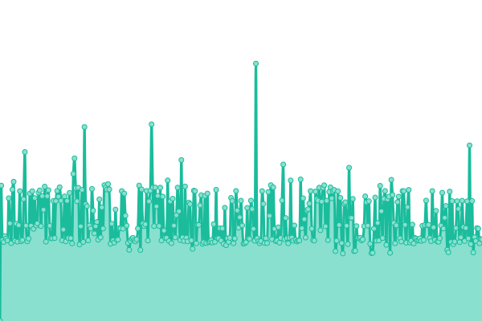 769ms
     
 | 

<a href="https://Sahalandro.github.io/upptimecheck/history/mbd-team">97.15%</a>
    

|  [wyngman](https://wyngman.mbd-team.de/) | 🟩 Up | [wyngman.yml](https://github.com/Sahalandro/upptimecheck/commits/HEAD/history/wyngman.yml) | 

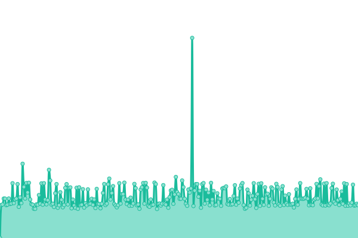 1037ms
     
 | 

<a href="https://Sahalandro.github.io/upptimecheck/history/wyngman">97.15%</a>
    

|  [shiftbutler](https://shiftbutler.mbd-team.de/) | 🟩 Up | [shiftbutler.yml](https://github.com/Sahalandro/upptimecheck/commits/HEAD/history/shiftbutler.yml) | 

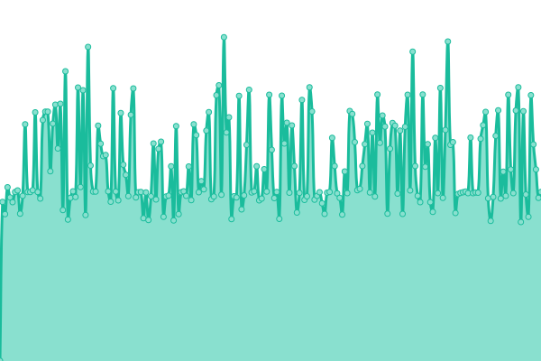 869ms
     
 | 

<a href="https://Sahalandro.github.io/upptimecheck/history/shiftbutler">94.31%</a>
    

|  [staging.britta-ai](demo.britta-ai.de) | 🟩 Up | [staging-britta-ai.yml](https://github.com/Sahalandro/upptimecheck/commits/HEAD/history/staging-britta-ai.yml) | 

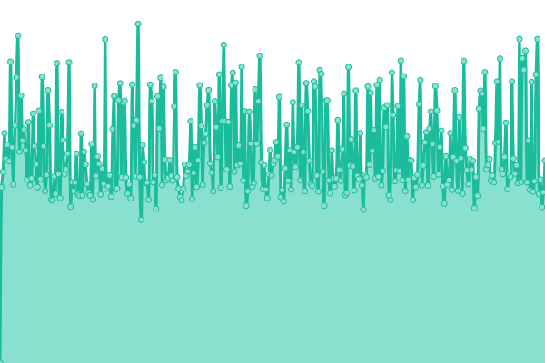 1472ms
     
 | 

<a href="https://Sahalandro.github.io/upptimecheck/history/staging-britta-ai">100.00%</a>
    

|  [staging.gymdistrict](staging.gymdistrict.mbd-team.de) | 🟩 Up | [staging-gymdistrict.yml](https://github.com/Sahalandro/upptimecheck/commits/HEAD/history/staging-gymdistrict.yml) | 

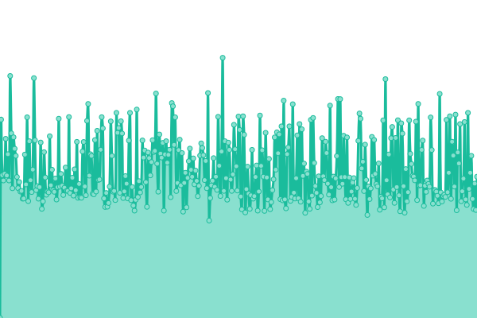 1164ms
     
 | 

<a href="https://Sahalandro.github.io/upptimecheck/history/staging-gymdistrict">100.00%</a>
    

|  [staging.herta](herta.mbd-team.de) | 🟥 Down | [staging-herta.yml](https://github.com/Sahalandro/upptimecheck/commits/HEAD/history/staging-herta.yml) | 

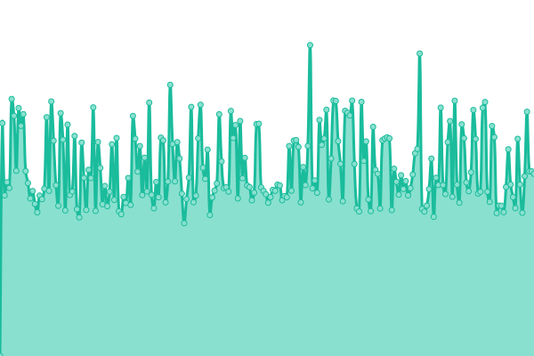 1586ms
     
 | 

<a href="https://Sahalandro.github.io/upptimecheck/history/staging-herta">44.19%</a>
    

|  [staging.holsteiner-huepfburgenverleih](staging.holsteiner-huepfburgenverleih.mbd-team.de) | 🟩 Up | [staging-holsteiner-huepfburgenverleih.yml](https://github.com/Sahalandro/upptimecheck/commits/HEAD/history/staging-holsteiner-huepfburgenverleih.yml) | 

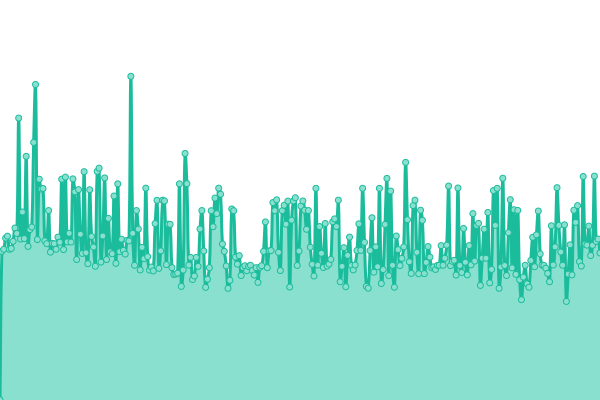 1021ms
     
 | 

<a href="https://Sahalandro.github.io/upptimecheck/history/staging-holsteiner-huepfburgenverleih">43.97%</a>
    

|  [staging.ki-helfer-general](staging.ki-helfer-general.mbd-team.de) | 🟩 Up | [staging-ki-helfer-general.yml](https://github.com/Sahalandro/upptimecheck/commits/HEAD/history/staging-ki-helfer-general.yml) | 

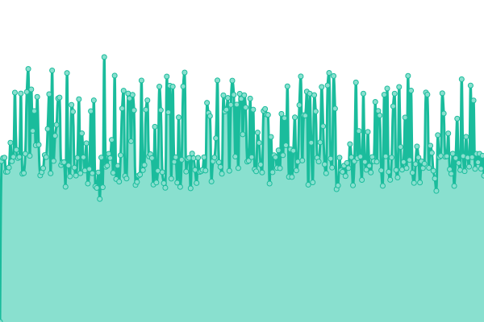 1380ms
     
 | 

<a href="https://Sahalandro.github.io/upptimecheck/history/staging-ki-helfer-general">100.00%</a>
    

|  [staging.mbd-team](staging.mbd-team.de) | 🟩 Up | [staging-mbd-team.yml](https://github.com/Sahalandro/upptimecheck/commits/HEAD/history/staging-mbd-team.yml) | 

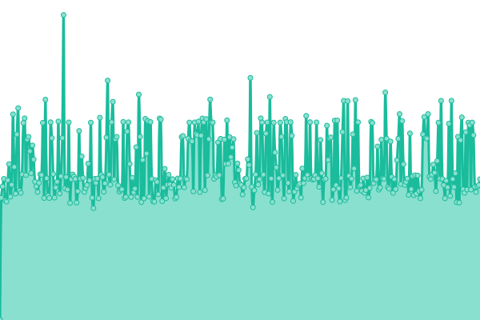 1213ms
     
 | 

<a href="https://Sahalandro.github.io/upptimecheck/history/staging-mbd-team">100.00%</a>
    

|  [staging.sportbutler](staging.sportbutler.team) | 🟩 Up | [staging-sportbutler.yml](https://github.com/Sahalandro/upptimecheck/commits/HEAD/history/staging-sportbutler.yml) | 

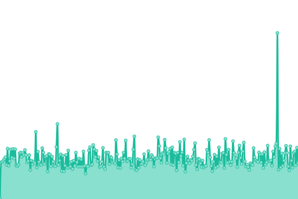 1235ms
     
 | 

<a href="https://Sahalandro.github.io/upptimecheck/history/staging-sportbutler">100.00%</a>
    

|  [staging.wyngman](staging.wyngman.mbd-team.de) | 🟩 Up | [staging-wyngman.yml](https://github.com/Sahalandro/upptimecheck/commits/HEAD/history/staging-wyngman.yml) | 

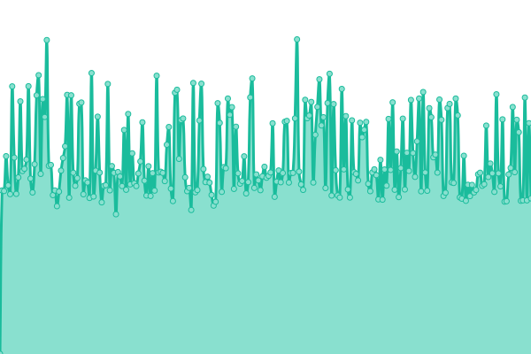 1383ms
     
 | 

<a href="https://Sahalandro.github.io/upptimecheck/history/staging-wyngman">100.00%</a>
    

<!--end: status pages-->

[**Visit our status website →**](https://demo.upptime.js.org)

## 📄 License

- Powered by: [Upptime](https://github.com/upptime/upptime)
- Code: [MIT](./LICENSE) © [Anand Chowdhary](https://anandchowdhary.com), supported by [Pabio](https://pabio.com)
- Data in the `./history` directory: [Open Database License](https://opendatacommons.org/licenses/odbl/1-0/)
