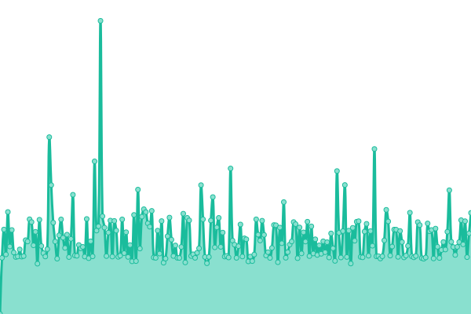
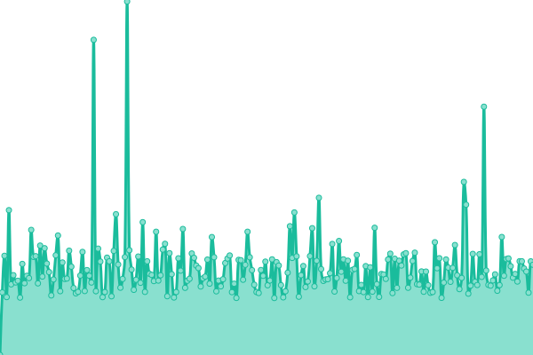
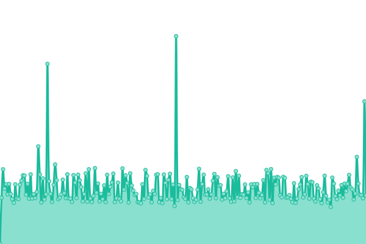

# [📈 Live Status](https://demo.upptime.js.org): <!--live status--> **🟩 All systems operational**

This repository contains the open-source uptime monitor and status page for [Upptime](https://upptime.js.org), powered by [Upptime](https://github.com/upptime/upptime).

With [Upptime](https://upptime.js.org), you can get your own unlimited and free uptime monitor and status page, powered entirely by a GitHub repository. We use [Issues](https://github.com/upptime/upptime/issues) as incident reports, [Actions](https://github.com/Sahalandro/upptimecheck/actions) as uptime monitors, and [Pages](https://demo.upptime.js.org) for the status page.

<!--start: status pages-->
<!-- This summary is generated by Upptime (https://github.com/upptime/upptime) -->
<!-- Do not edit this manually, your changes will be overwritten -->
<!-- prettier-ignore -->
| URL | Status | History | Response Time | Uptime |
| --- | ------ | ------- | ------------- | ------ |
|  [britta-ai.de](britta-ai.de) | 🟩 Up | [britta-ai-de.yml](https://github.com/Sahalandro/upptimecheck/commits/HEAD/history/britta-ai-de.yml) | 

 1481ms
     
 | 

<a href="https://Sahalandro.github.io/upptimecheck/history/britta-ai-de">100.00%</a>
    

|  [gymdistrict.de](gymdistrict.de) | 🟩 Up | [gymdistrict-de.yml](https://github.com/Sahalandro/upptimecheck/commits/HEAD/history/gymdistrict-de.yml) | 

 1213ms
     
 | 

<a href="https://Sahalandro.github.io/upptimecheck/history/gymdistrict-de">100.00%</a>
    

|  [sportbutler.team](sportbutler.team) | 🟩 Up | [sportbutler-team.yml](https://github.com/Sahalandro/upptimecheck/commits/HEAD/history/sportbutler-team.yml) | 

 1269ms
     
 | 

<a href="https://Sahalandro.github.io/upptimecheck/history/sportbutler-team">100.00%</a>
    

|  [holsteiner-huepfburgenverleih.de](holsteiner-huepfburgenverleih.de) | 🟩 Up | [holsteiner-huepfburgenverleih-de.yml](https://github.com/Sahalandro/upptimecheck/commits/HEAD/history/holsteiner-huepfburgenverleih-de.yml) | 

 1206ms
     
 | 

<a href="https://Sahalandro.github.io/upptimecheck/history/holsteiner-huepfburgenverleih-de">100.00%</a>
    

|  [ki-helfer-klinik.mbd-team.de](ki-helfer-klinik.mbd-team.de) | 🟩 Up | [ki-helfer-klinik-mbd-team-de.yml](https://github.com/Sahalandro/upptimecheck/commits/HEAD/history/ki-helfer-klinik-mbd-team-de.yml) | 

 1379ms
     
 | 

<a href="https://Sahalandro.github.io/upptimecheck/history/ki-helfer-klinik-mbd-team-de">100.00%</a>
    

|  [app.ki-helferlein.de](app.ki-helferlein.de) | 🟩 Up | [app-ki-helferlein-de.yml](https://github.com/Sahalandro/upptimecheck/commits/HEAD/history/app-ki-helferlein-de.yml) | 

 1315ms
     
 | 

<a href="https://Sahalandro.github.io/upptimecheck/history/app-ki-helferlein-de">100.00%</a>
    

|  [ki-helferlein.de](ki-helferlein.de) | 🟩 Up | [ki-helferlein-de.yml](https://github.com/Sahalandro/upptimecheck/commits/HEAD/history/ki-helferlein-de.yml) | 

 1840ms
     
 | 

<a href="https://Sahalandro.github.io/upptimecheck/history/ki-helferlein-de">100.00%</a>
    

|  [mbd-team.de](mbd-team.de) | 🟩 Up | [mbd-team-de.yml](https://github.com/Sahalandro/upptimecheck/commits/HEAD/history/mbd-team-de.yml) | 

 1190ms
     
 | 

<a href="https://Sahalandro.github.io/upptimecheck/history/mbd-team-de">100.00%</a>
    

|  [wyngman.mbd-team.de](wyngman.mbd-team.de) | 🟩 Up | [wyngman-mbd-team-de.yml](https://github.com/Sahalandro/upptimecheck/commits/HEAD/history/wyngman-mbd-team-de.yml) | 

 1430ms
     
 | 

<a href="https://Sahalandro.github.io/upptimecheck/history/wyngman-mbd-team-de">100.00%</a>
    

|  [shiftbutler.mbd-team.de](shiftbutler.mbd-team.de) | 🟩 Up | [shiftbutler-mbd-team-de.yml](https://github.com/Sahalandro/upptimecheck/commits/HEAD/history/shiftbutler-mbd-team-de.yml) | 

 1277ms
     
 | 

<a href="https://Sahalandro.github.io/upptimecheck/history/shiftbutler-mbd-team-de">100.00%</a>
    

|  [Staging: britta-ai.de](demo.britta-ai.de) | 🟩 Up | [staging-britta-ai-de.yml](https://github.com/Sahalandro/upptimecheck/commits/HEAD/history/staging-britta-ai-de.yml) | 

 1530ms
     
 | 

<a href="https://Sahalandro.github.io/upptimecheck/history/staging-britta-ai-de">100.00%</a>
    

|  [Staging: gymdistrict.mbd-team.de](staging.gymdistrict.mbd-team.de) | 🟩 Up | [staging-gymdistrict-mbd-team-de.yml](https://github.com/Sahalandro/upptimecheck/commits/HEAD/history/staging-gymdistrict-mbd-team-de.yml) | 

 1165ms
     
 | 

<a href="https://Sahalandro.github.io/upptimecheck/history/staging-gymdistrict-mbd-team-de">100.00%</a>
    

|  [Staging: herta.mbd-team.de](staging.herta.mbd-team.de) | 🟩 Up | [staging-herta-mbd-team-de.yml](https://github.com/Sahalandro/upptimecheck/commits/HEAD/history/staging-herta-mbd-team-de.yml) | 

 1700ms
     
 | 

<a href="https://Sahalandro.github.io/upptimecheck/history/staging-herta-mbd-team-de">100.00%</a>
    

|  [Staging: holsteiner-huepfburgenverleih.mbd-team.de](staging.holsteiner-huepfburgenverleih.mbd-team.de) | 🟩 Up | [staging-holsteiner-huepfburgenverleih-mbd-team-de.yml](https://github.com/Sahalandro/upptimecheck/commits/HEAD/history/staging-holsteiner-huepfburgenverleih-mbd-team-de.yml) | 

 1119ms
     
 | 

<a href="https://Sahalandro.github.io/upptimecheck/history/staging-holsteiner-huepfburgenverleih-mbd-team-de">100.00%</a>
    

|  [Staging: ki-helfer-general.mbd-team.de](staging.ki-helfer-general.mbd-team.de) | 🟩 Up | [staging-ki-helfer-general-mbd-team-de.yml](https://github.com/Sahalandro/upptimecheck/commits/HEAD/history/staging-ki-helfer-general-mbd-team-de.yml) | 

 1363ms
     
 | 

<a href="https://Sahalandro.github.io/upptimecheck/history/staging-ki-helfer-general-mbd-team-de">100.00%</a>
    

|  [Staging: staging.ki-helfer-klinik.mbd-team.de](staging.ki-helfer-klinik.mbd-team.de) | 🟩 Up | [staging-staging-ki-helfer-klinik-mbd-team-de.yml](https://github.com/Sahalandro/upptimecheck/commits/HEAD/history/staging-staging-ki-helfer-klinik-mbd-team-de.yml) | 

 1229ms
     
 | 

<a href="https://Sahalandro.github.io/upptimecheck/history/staging-staging-ki-helfer-klinik-mbd-team-de">100.00%</a>
    

|  [Staging: mbd-team.de](staging.mbd-team.de) | 🟩 Up | [staging-mbd-team-de.yml](https://github.com/Sahalandro/upptimecheck/commits/HEAD/history/staging-mbd-team-de.yml) | 

 1220ms
     
 | 

<a href="https://Sahalandro.github.io/upptimecheck/history/staging-mbd-team-de">100.00%</a>
    

|  [Staging: sportbutler.team](staging.sportbutler.team) | 🟩 Up | [staging-sportbutler-team.yml](https://github.com/Sahalandro/upptimecheck/commits/HEAD/history/staging-sportbutler-team.yml) | 

 1220ms
     
 | 

<a href="https://Sahalandro.github.io/upptimecheck/history/staging-sportbutler-team">100.00%</a>
    

|  [Staging: wyngman.mbd-team.de](staging.wyngman.mbd-team.de) | 🟩 Up | [staging-wyngman-mbd-team-de.yml](https://github.com/Sahalandro/upptimecheck/commits/HEAD/history/staging-wyngman-mbd-team-de.yml) | 

 1358ms
     
 | 

<a href="https://Sahalandro.github.io/upptimecheck/history/staging-wyngman-mbd-team-de">100.00%</a>
    

<!--end: status pages-->

[**Visit our status website →**](https://demo.upptime.js.org)

## 📄 License

- Powered by: [Upptime](https://github.com/upptime/upptime)
- Code: [MIT](./LICENSE) © [Anand Chowdhary](https://anandchowdhary.com), supported by [Pabio](https://pabio.com)
- Data in the `./history` directory: [Open Database License](https://opendatacommons.org/licenses/odbl/1-0/)
