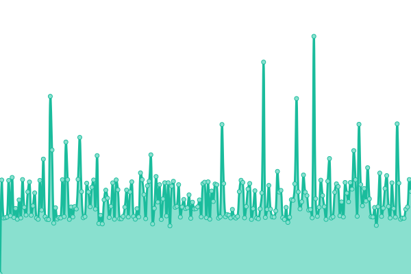
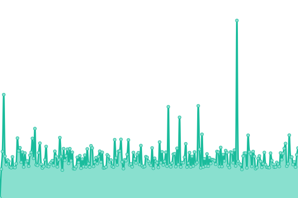
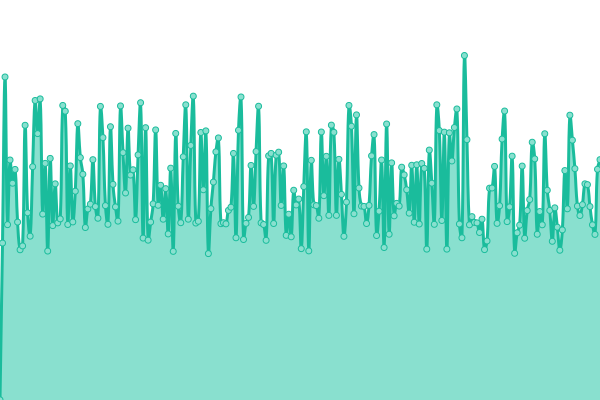

# [📈 Live Status](https://demo.upptime.js.org): <!--live status--> **🟩 All systems operational**

This repository contains the open-source uptime monitor and status page for [Upptime](https://upptime.js.org), powered by [Upptime](https://github.com/upptime/upptime).

With [Upptime](https://upptime.js.org), you can get your own unlimited and free uptime monitor and status page, powered entirely by a GitHub repository. We use [Issues](https://github.com/upptime/upptime/issues) as incident reports, [Actions](https://github.com/Sahalandro/upptimecheck/actions) as uptime monitors, and [Pages](https://demo.upptime.js.org) for the status page.

<!--start: status pages-->
<!-- This summary is generated by Upptime (https://github.com/upptime/upptime) -->
<!-- Do not edit this manually, your changes will be overwritten -->
<!-- prettier-ignore -->
| URL | Status | History | Response Time | Uptime |
| --- | ------ | ------- | ------------- | ------ |
|  [britta-ai.de](https://britta-ai.de/) | 🟩 Up | [britta-ai-de.yml](https://github.com/MBD-Team/upptimecheck/commits/HEAD/history/britta-ai-de.yml) | 

 1029ms
     
 | 

<a href="https://MBD-Team.github.io/upptimecheck/history/britta-ai-de">0.00%</a>
    

|  [gymdistrict.de](https://gymdistrict.de/) | 🟩 Up | [gymdistrict-de.yml](https://github.com/MBD-Team/upptimecheck/commits/HEAD/history/gymdistrict-de.yml) | 

 894ms
     
 | 

<a href="https://MBD-Team.github.io/upptimecheck/history/gymdistrict-de">0.00%</a>
    

|  [sportbutler.team](https://sportbutler.team/) | 🟩 Up | [sportbutler-team.yml](https://github.com/MBD-Team/upptimecheck/commits/HEAD/history/sportbutler-team.yml) | 

 878ms
     
 | 

<a href="https://MBD-Team.github.io/upptimecheck/history/sportbutler-team">0.00%</a>
    

|  [holsteiner-huepfburgenverleih.de](https://holsteiner-huepfburgenverleih.de/) | 🟩 Up | [holsteiner-huepfburgenverleih-de.yml](https://github.com/MBD-Team/upptimecheck/commits/HEAD/history/holsteiner-huepfburgenverleih-de.yml) | 

 892ms
     
 | 

<a href="https://MBD-Team.github.io/upptimecheck/history/holsteiner-huepfburgenverleih-de">0.00%</a>
    

|  [ki-helfer-klinik.mbd-team.de](https://ki-helfer-klinik.mbd-team.de/) | 🟩 Up | [ki-helfer-klinik-mbd-team-de.yml](https://github.com/MBD-Team/upptimecheck/commits/HEAD/history/ki-helfer-klinik-mbd-team-de.yml) | 

 1048ms
     
 | 

<a href="https://MBD-Team.github.io/upptimecheck/history/ki-helfer-klinik-mbd-team-de">100.00%</a>
    

|  [app.ki-helferlein.de](https://app.ki-helferlein.de/) | 🟩 Up | [app-ki-helferlein-de.yml](https://github.com/MBD-Team/upptimecheck/commits/HEAD/history/app-ki-helferlein-de.yml) | 

 954ms
     
 | 

<a href="https://MBD-Team.github.io/upptimecheck/history/app-ki-helferlein-de">100.00%</a>
    

|  [ki-helferlein.de](https://ki-helferlein.de/) | 🟩 Up | [ki-helferlein-de.yml](https://github.com/MBD-Team/upptimecheck/commits/HEAD/history/ki-helferlein-de.yml) | 

 1448ms
     
 | 

<a href="https://MBD-Team.github.io/upptimecheck/history/ki-helferlein-de">100.00%</a>
    

|  [mbd-team.de](https://mbd-team.de/) | 🟩 Up | [mbd-team-de.yml](https://github.com/MBD-Team/upptimecheck/commits/HEAD/history/mbd-team-de.yml) | 

 883ms
     
 | 

<a href="https://MBD-Team.github.io/upptimecheck/history/mbd-team-de">100.00%</a>
    

|  [wyngman.mbd-team.de](https://wyngman.mbd-team.de/) | 🟩 Up | [wyngman-mbd-team-de.yml](https://github.com/MBD-Team/upptimecheck/commits/HEAD/history/wyngman-mbd-team-de.yml) | 

 1135ms
     
 | 

<a href="https://MBD-Team.github.io/upptimecheck/history/wyngman-mbd-team-de">100.00%</a>
    

|  [shiftbutler.mbd-team.de](https://shiftbutler.mbd-team.de/) | 🟩 Up | [shiftbutler-mbd-team-de.yml](https://github.com/MBD-Team/upptimecheck/commits/HEAD/history/shiftbutler-mbd-team-de.yml) | 

 997ms
     
 | 

<a href="https://MBD-Team.github.io/upptimecheck/history/shiftbutler-mbd-team-de">100.00%</a>
    

|  [herta.mbd-team.de](https://herta.mbd-team.de/) | 🟩 Up | [herta-mbd-team-de.yml](https://github.com/MBD-Team/upptimecheck/commits/HEAD/history/herta-mbd-team-de.yml) | 

 1208ms
     
 | 

<a href="https://MBD-Team.github.io/upptimecheck/history/herta-mbd-team-de">100.00%</a>
    

|  [Client: allcon-import.de](https://www.allcon-import.de/) | 🟩 Up | [client-allcon-import-de.yml](https://github.com/MBD-Team/upptimecheck/commits/HEAD/history/client-allcon-import-de.yml) | 

 1125ms
     
 | 

<a href="https://MBD-Team.github.io/upptimecheck/history/client-allcon-import-de">100.00%</a>
    

|  [Client: www.elbeholz.net](https://www.elbeholz.net/) | 🟩 Up | [client-www-elbeholz-net.yml](https://github.com/MBD-Team/upptimecheck/commits/HEAD/history/client-www-elbeholz-net.yml) | 

 249ms
     
 | 

<a href="https://MBD-Team.github.io/upptimecheck/history/client-www-elbeholz-net">100.00%</a>
    

|  [Client: woelke-sh.de](https://woelke-sh.de/) | 🟩 Up | [client-woelke-sh-de.yml](https://github.com/MBD-Team/upptimecheck/commits/HEAD/history/client-woelke-sh-de.yml) | 

 2448ms
     
 | 

<a href="https://MBD-Team.github.io/upptimecheck/history/client-woelke-sh-de">100.00%</a>
    

|  [Client: blumen-für-gudendorf.de](https://xn--blumen-fr-gudendorf-dbc.de/) | 🟩 Up | [client-blumen-fuer-gudendorf-de.yml](https://github.com/MBD-Team/upptimecheck/commits/HEAD/history/client-blumen-fuer-gudendorf-de.yml) | 

 4330ms
     
 | 

<a href="https://MBD-Team.github.io/upptimecheck/history/client-blumen-fuer-gudendorf-de">100.00%</a>
    

|  [Staging: britta-ai.de](demo.britta-ai.de) | 🟩 Up | [staging-britta-ai-de.yml](https://github.com/MBD-Team/upptimecheck/commits/HEAD/history/staging-britta-ai-de.yml) | 

 1633ms
     
 | 

<a href="https://MBD-Team.github.io/upptimecheck/history/staging-britta-ai-de">100.00%</a>
    

|  [Staging: gymdistrict.mbd-team.de](staging.gymdistrict.mbd-team.de) | 🟩 Up | [staging-gymdistrict-mbd-team-de.yml](https://github.com/MBD-Team/upptimecheck/commits/HEAD/history/staging-gymdistrict-mbd-team-de.yml) | 

 1356ms
     
 | 

<a href="https://MBD-Team.github.io/upptimecheck/history/staging-gymdistrict-mbd-team-de">100.00%</a>
    

|  [Staging: herta.mbd-team.de](staging.herta.mbd-team.de) | 🟩 Up | [staging-herta-mbd-team-de.yml](https://github.com/MBD-Team/upptimecheck/commits/HEAD/history/staging-herta-mbd-team-de.yml) | 

 1703ms
     
 | 

<a href="https://MBD-Team.github.io/upptimecheck/history/staging-herta-mbd-team-de">100.00%</a>
    

|  [Staging: holsteiner-huepfburgenverleih.mbd-team.de](staging.holsteiner-huepfburgenverleih.mbd-team.de) | 🟩 Up | [staging-holsteiner-huepfburgenverleih-mbd-team-de.yml](https://github.com/MBD-Team/upptimecheck/commits/HEAD/history/staging-holsteiner-huepfburgenverleih-mbd-team-de.yml) | 

 1242ms
     
 | 

<a href="https://MBD-Team.github.io/upptimecheck/history/staging-holsteiner-huepfburgenverleih-mbd-team-de">100.00%</a>
    

|  [Staging: ki-helfer-general.mbd-team.de](staging.ki-helfer-general.mbd-team.de) | 🟩 Up | [staging-ki-helfer-general-mbd-team-de.yml](https://github.com/MBD-Team/upptimecheck/commits/HEAD/history/staging-ki-helfer-general-mbd-team-de.yml) | 

 1485ms
     
 | 

<a href="https://MBD-Team.github.io/upptimecheck/history/staging-ki-helfer-general-mbd-team-de">100.00%</a>
    

|  [Staging: ki-helfer-klinik.mbd-team.de](staging.ki-helfer-klinik.mbd-team.de) | 🟩 Up | [staging-ki-helfer-klinik-mbd-team-de.yml](https://github.com/MBD-Team/upptimecheck/commits/HEAD/history/staging-ki-helfer-klinik-mbd-team-de.yml) | 

 1357ms
     
 | 

<a href="https://MBD-Team.github.io/upptimecheck/history/staging-ki-helfer-klinik-mbd-team-de">100.00%</a>
    

|  [Staging: mbd-team.de](staging.mbd-team.de) | 🟩 Up | [staging-mbd-team-de.yml](https://github.com/MBD-Team/upptimecheck/commits/HEAD/history/staging-mbd-team-de.yml) | 

 1313ms
     
 | 

<a href="https://MBD-Team.github.io/upptimecheck/history/staging-mbd-team-de">100.00%</a>
    

|  [Staging: sportbutler.team](staging.sportbutler.team) | 🟩 Up | [staging-sportbutler-team.yml](https://github.com/MBD-Team/upptimecheck/commits/HEAD/history/staging-sportbutler-team.yml) | 

 1315ms
     
 | 

<a href="https://MBD-Team.github.io/upptimecheck/history/staging-sportbutler-team">100.00%</a>
    

|  [Staging: wyngman.mbd-team.de](staging.wyngman.mbd-team.de) | 🟩 Up | [staging-wyngman-mbd-team-de.yml](https://github.com/MBD-Team/upptimecheck/commits/HEAD/history/staging-wyngman-mbd-team-de.yml) | 

 1452ms
     
 | 

<a href="https://MBD-Team.github.io/upptimecheck/history/staging-wyngman-mbd-team-de">100.00%</a>
    

<!--end: status pages-->

[**Visit our status website →**](https://demo.upptime.js.org)

## 📄 License

- Powered by: [Upptime](https://github.com/upptime/upptime)
- Code: [MIT](./LICENSE) © [Anand Chowdhary](https://anandchowdhary.com), supported by [Pabio](https://pabio.com)
- Data in the `./history` directory: [Open Database License](https://opendatacommons.org/licenses/odbl/1-0/)
